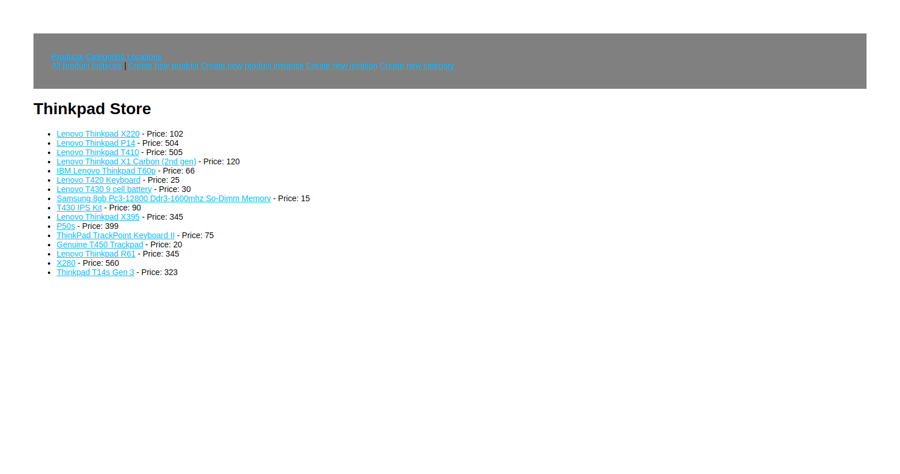

# Inventory App

[](https://inventory-app-production-5781.up.railway.app)

[Live preview](https://inventory-app-production-5781.up.railway.app)

## Table of Contents

- Introduction
- Features
- Installation
- Configuration
- Usage
- Technologies Used
- License

### Introduction

Welcome to the Inventory App! This robust application leverages Express as the server framework, EJS templates for rendering, Multer for seamless file uploads, and HTML Entities for effective decoding. It utilizes MongoDB for the database, ensuring efficient data management while safeguarding sensitive information via private variables handled through an .env file.

The app serves as an intuitive platform tailored for employees of a laptop store, empowering them to seamlessly manage products. It categorizes items, stores comprehensive details including descriptions and specifications, enables easy identification through uploaded thumbnails, and maintains a detailed log of each product's stock across various locations.

### Features

- **Effortless Product Creation**: Input product names, descriptions, upload corresponding thumbnails, assign categories, specify detailed specifications, and set sale prices seamlessly.
- **Organizational Flexibility**: Add and manage categories and locations, facilitating organized product management as per unique business needs.
- **Location-Based Stock Management**: Create product instances for each location, enabling meticulous control and tracking of stock levels across multiple sites.
- **Dynamic Information Management**: Update and delete product information swiftly and efficiently, ensuring data accuracy and relevance.
- **Secure Data Handling**: Leveraging MongoDB for secure and scalable data storage, with sensitive information managed through an .env file.
- **Scalability and Reliability**: Deployment on Railway ensures scalability and reliability, guaranteeing a stable and robust system for uninterrupted operations.

### Installation

To run the Inventory App locally, follow these steps:

Clone the repository:

```bash
git clone https://github.com/zakrnem/inventory-app.git
```

Navigate to the project directory:

```bash
cd inventory-app
```

Install dependencies:

```bash
npm install
```

### Configuration

Create a .env file in the root directory of the project.

Add the following variables to the .env file:

```env
USER_NAME=Your Username
PASSWORD=Your Password
URL=your-project-cluster.mongodb.net
```

Replace the values with your preferred settings.

### Usage

Start the application:

```bash
npm run serverstart
```

Open your web browser and navigate to http://localhost:3000.

### Technologies Used

- Express.js
- Multer
- EJS
- MongoDB
- HTML Entities
- CSS
- Railway for deployment

### License

This project is licensed under the MIT License.
